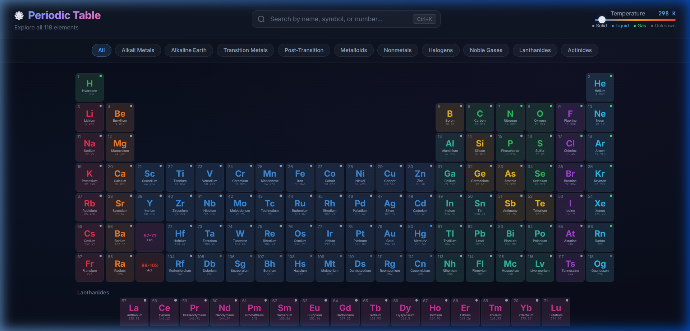
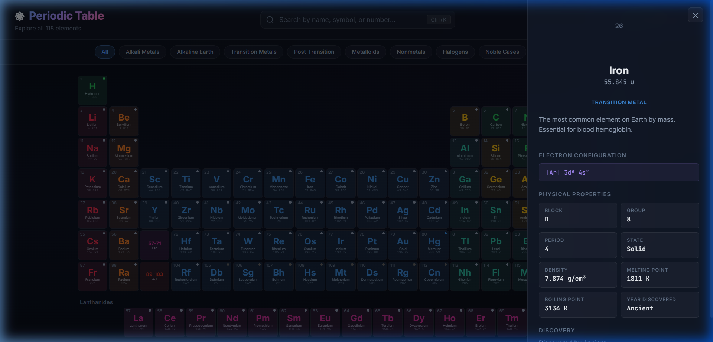
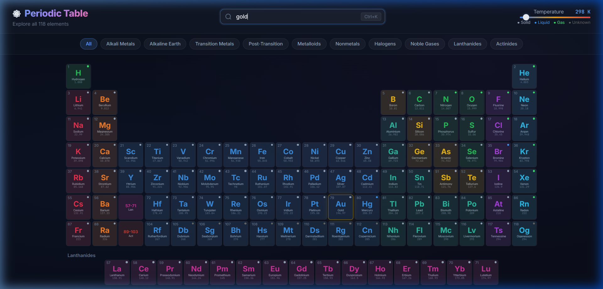
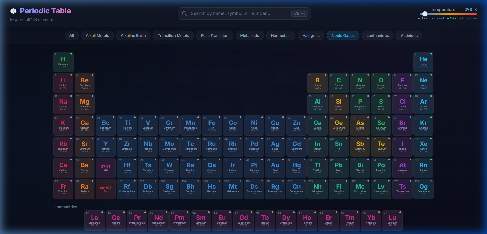

# ⚛️ Interactive Periodic Table

A visually stunning, interactive periodic table web app featuring all **118 elements** with detailed properties, live search, category filters, and a temperature-based state visualizer.

> Built with pure **HTML**, **CSS**, and **JavaScript** — no frameworks, no dependencies.



---

## ✨ Features

- 🎨 **Modern Dark Theme** — Sleek dark UI with vibrant, category-coded element colors and glassmorphism effects
- 🧪 **All 118 Elements** — Displayed in the standard periodic table layout with lanthanides and actinides
- 📋 **Detail Panel** — Click any element to view atomic mass, electron configuration, physical properties, and discovery info
- 🔍 **Live Search** — Instantly find elements by name, symbol, or atomic number (`Ctrl+K` shortcut)
- 🏷️ **Category Filters** — Highlight element groups: Alkali Metals, Noble Gases, Halogens, and more
- 🌡️ **Temperature Slider** — See which elements are solid, liquid, or gas at any temperature (0–6000 K)
- ✨ **Micro-animations** — Hover glow effects, staggered fade-ins, and smooth panel transitions
- 📱 **Responsive** — Adapts to different screen sizes

---

## 📸 Screenshots

### Element Detail Panel
Click any element to see its full properties in a glassmorphism side panel:



### Search
Search by name, symbol, or atomic number — matching elements are highlighted:



### Category Filter
Filter by element category — Noble Gases, Transition Metals, Halogens, etc.:



---


## 📁 Project Structure

```
├── index.html      # Main HTML page
├── index.css       # Dark theme design system & responsive styles
├── elements.js     # All 118 elements data
├── app.js          # Grid rendering, interactions, search, filters
└── screenshots/    # Screenshots for README
```

---

## 🛠️ Technologies

| Tech | Usage |
|------|-------|
| **HTML5** | Semantic structure |
| **CSS3** | Custom properties, Grid, glassmorphism, animations |
| **JavaScript** | DOM manipulation, event handling |
| **Google Fonts** | Inter & JetBrains Mono |

---

## 🎮 Keyboard Shortcuts

| Shortcut | Action |
|----------|--------|
| `Ctrl + K` | Focus search bar |
| `Escape` | Close detail panel |

---

## 📄 License

MIT License — feel free to use, modify, and share!

---

<p align="center">
  Made with ❤️ and ⚛️
</p>
